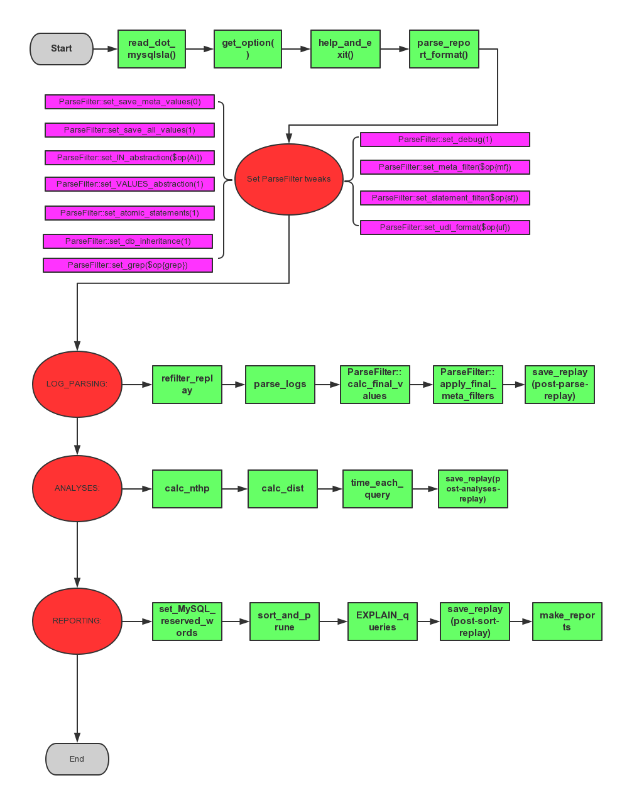

# mysqlsla 源码解析
>
There are 3 packages in this file, in this order:

    1. (MySQL::Log::)ParseFilter
    2. ReportFormats
    3. mysqlsla

## 知识结构

---
* **目的： 通过mysqlsla的源码分析，能够更加深入理解其内部实现机制**

* **mysqlsla 主要分为三个大的packages，我们先大致了解一下package 都包含什么，都做什么**

* **分析 main 函数，一步步了解主要流程**

* **针对一条线进行分析，比如slow log 的解析**

## Packages
---

* **(MySQL::Log::)ParseFilter** 

函数名 | 功能简介|
---- | ---- |
get_meta_filter| 获取meta fileter|
get_statement_filter|获取statement fileter|
set_save_meta_values|
set_save_all_values|
set_IN_abstraction|
set_VALUES_abstraction|
set_atomic_statements|
set_db_inheritance|
set_grep|
set_meta_filter|
set_statement_filter|
set_udl_format|
parse_binary_logs|
parse_general_logs|
parse_slow_logs|
parse_udl_logs|
check_stmt|
abstract_stmt|
compact_IN|
compact_VALUES|
passes_statement_filter|
passes_meta_filter|
calc_final_values|
apply_final_meta_filters|
set_debug|
_d|
_p|

* **ReportFormats**

函数名|功能简介|
----|----|
get_report_format| 获取log type
report_formats{slow} | slow 报表
report_formats{general} | general 报表
report_formats{binary} | binary 报表
report_formats{msl} | msl 报表
report_formats{udl} | udl 报表

* **LogType**

函数名|功能简介|
----|----|
new|
get_log_type|
lines_match_log_type|
name_for|
_d|

* **QueryRewriter**

函数名|功能简介|
----|----|
new|
strip_comments|
fingerprint|
convert_to_select|
convert_select_list|
__delete_to_select|
__insert_to_select|
__update_to_select|
wrap_in_derived|
_d|

* **main**
 
函数名|功能简介|
----|----|
help_and_exit|
read_mycnf|
read_dot_mysqlsla|
connect_to_MySQL|
parse_logs|
refilter_replay|
calc_nthp|
calc_dist|
EXPLAIN_queries|
get_create_table|
get_row_count|
parse_table_aliases|
get_table_ref|
time_each_query|
time_profile|
calc_rows_read|
sort_and_prune|
make_reports|
standard_report|
dump_report|
time_all_report|
print_all_report|
print_unique_report|
resolve_coded_value|
parse_report_format|
save_replay|
beautify|
stmt_users_summary|
EXPLAIN_summary|
schema_summary|
avg|
p|
format_u_time|
make_short|
d|
get_options|
set_MySQL_reserved_words|

## main 主要流程图

 

