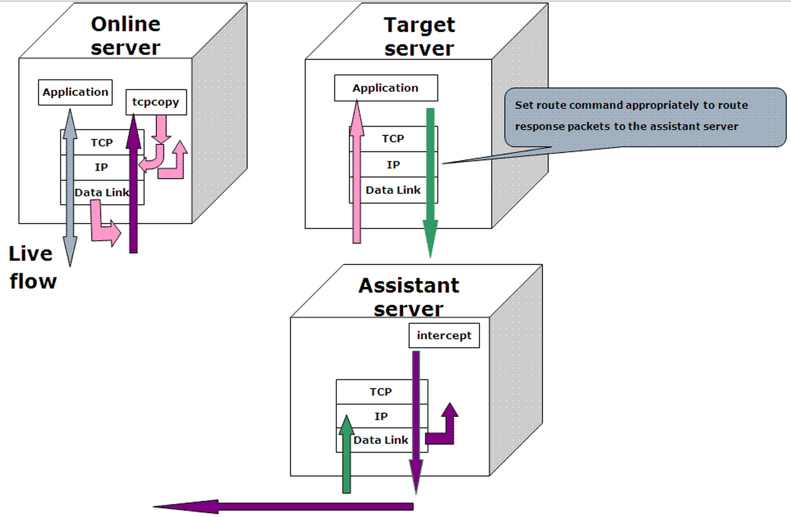
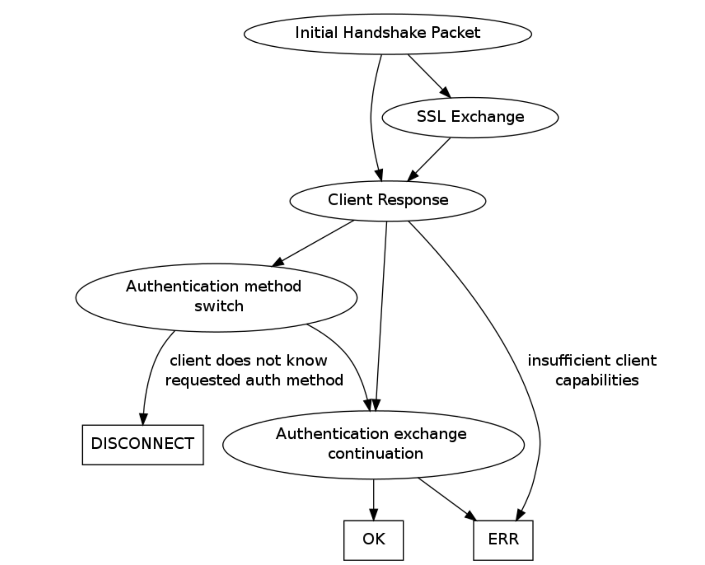
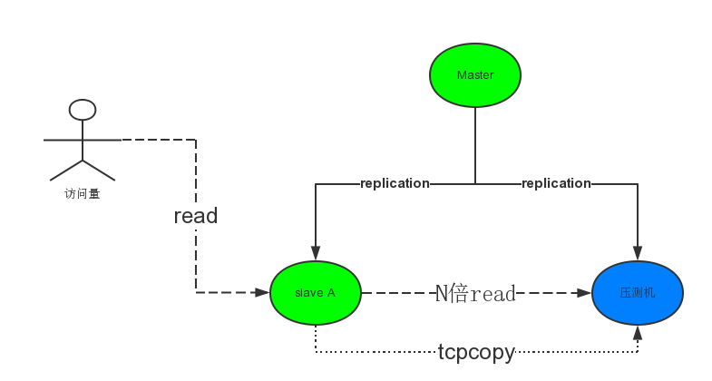

# Mysql压力测试
---

## 目的

* 采购新设备，评估新设备性能
* 检验新系统可靠性
* 提前发现潜在问题
* 性能容量评估
* 更换数据库版本，评估性能变化

## 方法

* 基于SQL模型的压力测试

```
可以开启一天的genlog，或者用tcpdump抓包，然后分析SQL日志，提取所有SQL模型，然后针对性的测试

困难：
	1）分析SQL的难度
	2）不实时
	3）如何复制多台
	
基于种种原因，这种方案不太靠谱。
```


* Tcpcopy复制线上流量，将其replay（可以N倍）到另一台server上

```
优点： 
	1）真正的压力测试
	2）近乎真实效果
	3）实时转发
	4）对在线系统影响很小
	5）不仅仅压力测试，下面我还会介绍一种用法，SQL模型分析。
	
缺点：
	1）有压力瓶颈
	2）由于用pcap抓包，不会100%精确
	3）丢失请求率跟网络状况有关
	4) TCPCOPY只与ip、tcp层的数据有关，如果请求验证与tcp层以上的协议有关，则系统不能正常运行
``` 

## Tcpcopy 

* 使用方法，这个我不太多介绍，可以完全参考官方文档。但是我后面会介绍使用过程中遇到的坑和注意点。

* 架构图



* Mysql协议



* 总结，由此可知，我们要采用skip-grant-tables方式，避开权限验证。

* 优化项


```
两种编译版本：
1) cd tcpcopy-0.9.6 && ./configure --enable-mysqlsgt && make && make install  -- mysqlcopy  支持mysql replay 日志。
2) cd tcpcopy-0.9.6 && ./configure && make && make install  --默认安装，tcpcopy，不支持mysql replay日志

测试机器端
＃优化
sysctl -w net.core.rmem_max=67108864 
sysctl -w net.core.wmem_max=67108864
echo 5120 >/proc/sys/net/ipv4/ip_queue_maxlen

＃启动
modprobe ip_queue 
modprobe -l | grep ip_queue
iptables -I OUTPUT -p tcp --sport 3306 -j QUEUE
intercept -d -l /data_1/error.log //daemon方式运行
iptables -vnL  // 查看iptables 允许的端口  与 iptables -I OUTPUT -p tcp --sport 3306 -j QUEUE  对应
＃检查
cat /proc/net/ip_queue

生产服务器
tcpcopy -d -l /root/tcpcopy_err.log -x 3306-10.10.8.65:3306 //daemon 方式

优化
echo “262144” /proc/sys/net/ipv4/ip_conntrack_max
```

* 遇到的问题与分析

```
==tcpcopy的问题，与思考==
1)为什么tcpcopy的数量比mysql内部统计的要少很多？
a 有很多长链接的信息，tcpcopy无法抓取到。
b 丢包的问题。
c tcpcopy没有配置正确。--比如：./configure --enable-mysqlgst等
d tcpdump自身丢包非常严重，解决方法，用pfring配合tcpdump使用。
e 测试服务器mysql 的连接设置的太少，很多都too many connection,然后无法建立链接，所以少了很多数据。
f tcpcopy的bug ， php 的短链接问题

==丢包的可能性==
原因有很多：
1）抓包可能丢包
2）发包过程中，在本地被干掉
3）包传递过程中，被过滤掉，使其抵达不了测试机器
4）测试服务器的ip层干扰，比如iptables的干扰，rp_filter的干扰等等种类繁多
5）应用协议不支持pipelining，导致只读取socket buffer中的第一个请求
6）测试服务器速度跟不上在线处理速度，导致被迫丢失sessin数据
7）如果是传统架构，ip queue丢响应包
8）应用程序处理超时
10）测试服务器处理不了那么多流量，比如系统参数用默认的系统参数

```

## Tcpcopy 引流压力测试方案图



## 总结

* tcpcopy 相比于 mysqlslap 这种压测 ，优势太明显了。
* tcpcopy 不仅仅做压力测试，还能够实时将多台机器的流量转发到hadoop，用于SQl模型分析。

