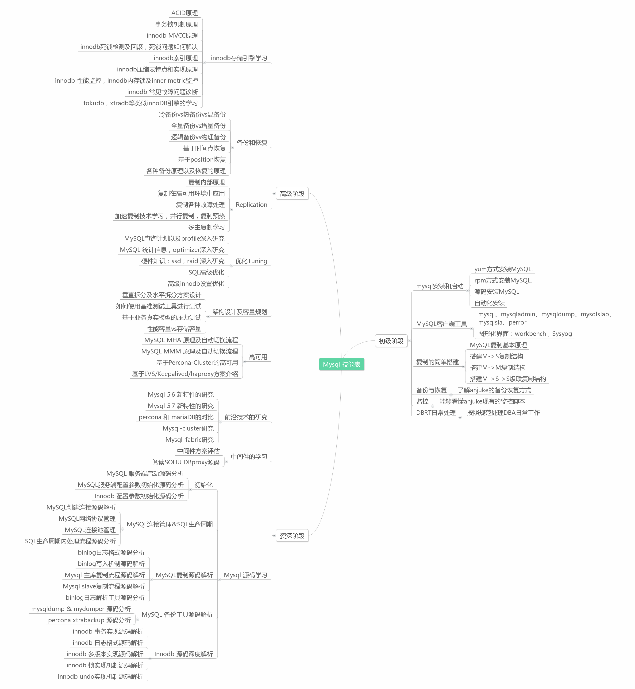
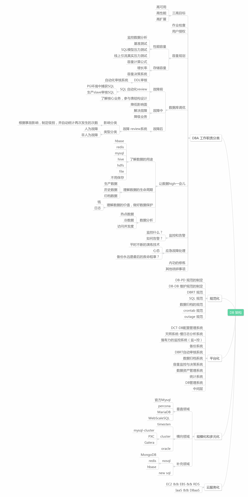

# DBA架构师 申请

* **兰春** 2012年3月份加入安居客，工作至今

* **工作岗位** DB架构部 高级DBA

* **工作范围** 维护Mysql相关所有事项

* **近期项目** RBU项目，天照系统，新技术研究，innoDB新监控系统 等。

## Code
---

* [mysql日志分析工具之源码解析，包括bug修复，新增功能](https://github.com/Keithlan/Keithlan.github.io/blob/master/github_md/Mysql/SYSTEM_TOOLS/tz_slow/mysqlsla_source_read.md)

* [InnoDB新监控系统](https://github.com/Keithlan/Keithlan.github.io/blob/master/github_md/Mysql/SYSTEM_TOOLS/innodb_monitor/v_monitor.sql)

* [数据归档](https://github.com/Keithlan/Keithlan.github.io/blob/master/github_md/Mysql/SCRIPT/archive_by_date.pl)

* [genlog导入hadoop](https://github.com/Keithlan/Keithlan.github.io/blob/master/github_md/Mysql/SCRIPT/genlog_to_hadoop.pl)

## System
---

### Tech for tech

* [备份与恢复原理详解，针对业界与安居客业务对比，改进原有备份恢复方式](https://github.com/Keithlan/Keithlan.github.io/blob/master/github_md/Mysql/BACKUP_RECOVERY/backup_recovery.pdf)

* [数据库性能优化之查询优化](https://github.com/Keithlan/Keithlan.github.io/blob/master/github_md/Mysql/PERFORMANCE_TUNING/%E6%95%B0%E6%8D%AE%E5%BA%93%E6%80%A7%E8%83%BD%E4%BC%98%E5%8C%96%E4%B9%8B%E6%9F%A5%E8%AF%A2%E4%BC%98%E5%8C%96_final.pdf)

* [mysqlsla使用介绍](https://github.com/Keithlan/Keithlan.github.io/blob/master/github_md/Mysql/SYSTEM_TOOLS/tz_slow/mysqsla.md)

* [mysql error 1048解决方案](https://github.com/Keithlan/Keithlan.github.io/blob/master/github_md/Mysql/ERROR_HANDLE/mysql_error_1048.md)

* [mysql5.6 执行计划错误案例分析](https://github.com/Keithlan/Keithlan.github.io/blob/master/github_md/Mysql/ERROR_HANDLE/mysql_group_order_limit.md)

* [MySQL5.6 中 In 优化的那些事](https://github.com/Keithlan/Keithlan.github.io/blob/master/github_md/Mysql/ERROR_HANDLE/mysql_in.md)

* [特殊场景下的slave重构](https://github.com/Keithlan/Keithlan.github.io/blob/master/github_md/Mysql/ERROR_HANDLE/mysql_recovery_myisam_slave.md)

* [mysql shutdown 异常处理和分析](https://github.com/Keithlan/Keithlan.github.io/blob/master/github_md/Mysql/ERROR_HANDLE/mysql_shutdown/mysql_shutdown_err.md)

## QA
---

* [压力测试](https://github.com/Keithlan/Keithlan.github.io/blob/master/github_md/Mysql/TEST/tcpcopy.md)

* [边界测试](https://github.com/Keithlan/Keithlan.github.io/blob/master/github_md/Nosql/sqoop/sqoop.md)

* [可靠性测试](https://github.com/Keithlan/Keithlan.github.io/tree/master/github_md//Mysql/HA/Keepalived/Keepalived.md)

## Teamwork
---

* **曾经带领并帮助过团队成员（廖化生，张吉，朱鹏飞）快速熟悉DBA工作**

* **给公司研发小伙伴做过一次大型分享**

* **不定期以邮件的方式给公司技术部分享DB知识，尽量让大家对DB产生兴趣**

* **在DBA team内部，做过多次分享，包括故障的案例分析，以及前沿技术的探索等**

* **工作中主动积极地编写技术文档，让DBA的经验能够很好的传承下去**

## Achievement
---
* **安龄：3年**
* **2014年 获得过一级干货一枚**
* **2014年 获得过最具价值项目奖**
* **2014年 被评为优秀工程师**

## 总结
---
在安居客已经三年了，这三年中让我经历了从 (不知道做什么-->知道做什么-->怎么做) 到 (为什么做-->为什么要做-->为什么不做-->未来要做什么) 的路程。 值得欣喜的是这三年中见证了多次DB架构的变迁，包括IDC的大迁移，数据库拆分（表级，库级），Mysql的版本也从最初的5.0，到5.1，5.5，现在已经升级到5.6 等等。 三年的成长，让我认识到了目前的DB架构的不足，我们要做的还有很多，要走的路还有很长。以下是我对DB组未来3年内的规划以及对后端的一些思考，分为： 内功篇 和 外功篇

### 内功篇

### 外功篇

